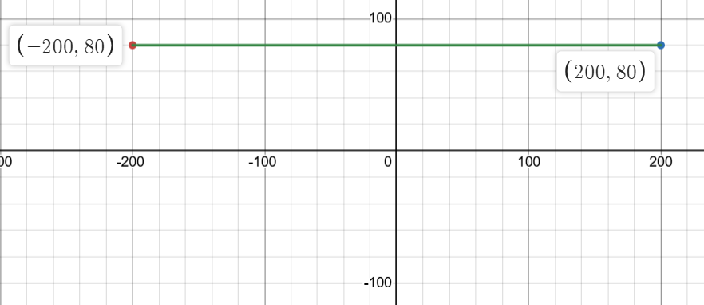
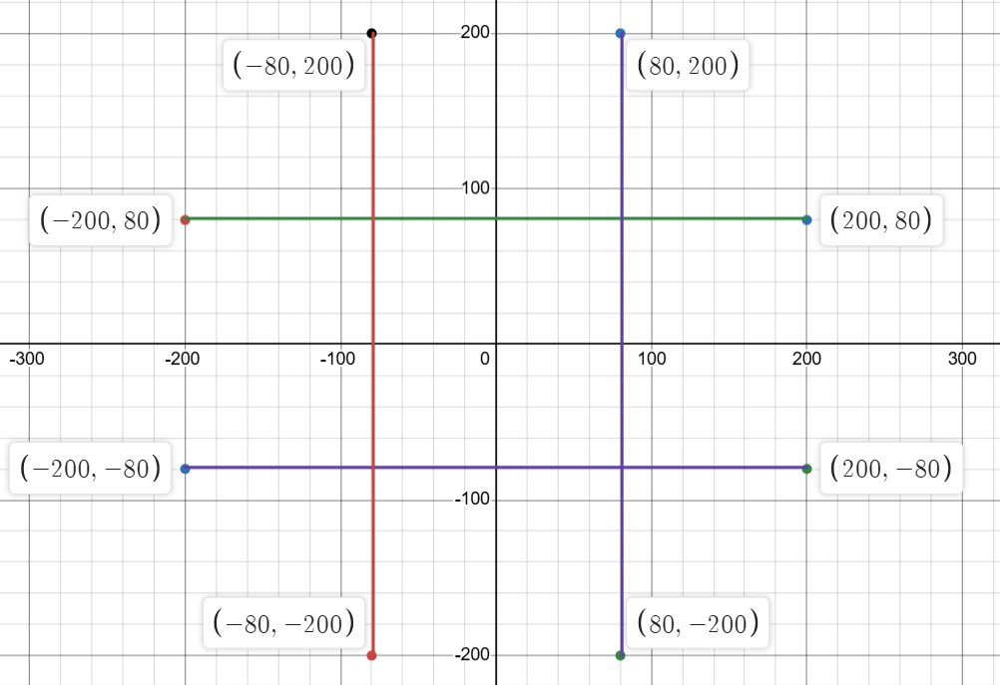

We're given that draw_segment(a, b, c, d) draws a segment from the point (a, b) to (c, d).

We want to draw the following segments:
* (-200, 80) to (200, 80)
* (-200, -80) to (200, -80)
* (-80, -200) to (-80, 200)
* (80, -200) to (80, 200)

Let's take a look at the first segment. 

We want to match up (-200, 80) to (200, 80) \
to the segment function for(a, b)     to (c, d)
For the first segment, a = -200, b = 80, c = 200, and d = 80. 

Thus, the function call will be draw_segment(-200, 80, 200, 80). 

With this one line, the following will be drawn:


Similarly, the function calls for the other 3 segments will be
* draw_segment(-200, -80, 200, -80)
* draw_segment(-80, -200, -80, 200)
* draw_segment(80, -200, 80, 200)

Final code for draw_board:
```python
draw_segment(-200, 80, 200, 80)
draw_segment(-200, -80, 200, -80)
draw_segment(-80, -200, -80, 200)
draw_segment(80, -200, 80, 200)
```
With all of the lines, the board should look like this:


